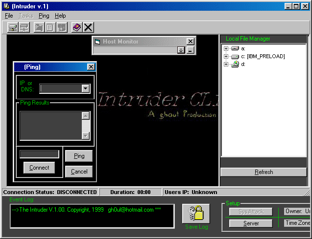



## Intruder \- Remote server control

### Description

The intruder is a complete tools for the remote control of server. You can send a message box, browse file, attack server, ping, task manager...

Very cool! I have find this and I have made some changes...
 
### More Info
 

             |
---                |---
**Submitted On**   |2000-03-09 09:52:52
**By**             |[Gino Lollita \- Carta VBMan](https://github.com/Planet-Source-Code/PSCIndex/blob/master/ByAuthor/gino-lollita-carta-vbman.md)
**Level**          |Advanced
**User Rating**    |4.4 (35 globes from 8 users)
**Compatibility**  |VB 5\.0, VB 6\.0
**Category**       |[Complete Applications](https://github.com/Planet-Source-Code/PSCIndex/blob/master/ByCategory/complete-applications__1-27.md)
**World**          |[Visual Basic](https://github.com/Planet-Source-Code/PSCIndex/blob/master/ByWorld/visual-basic.md)
**Archive File**   |[CODE\_UPLOAD3886392000\.zip](https://github.com/Planet-Source-Code/gino-lollita-carta-vbman-intruder-remote-server-control__1-6498/archive/master.zip)

